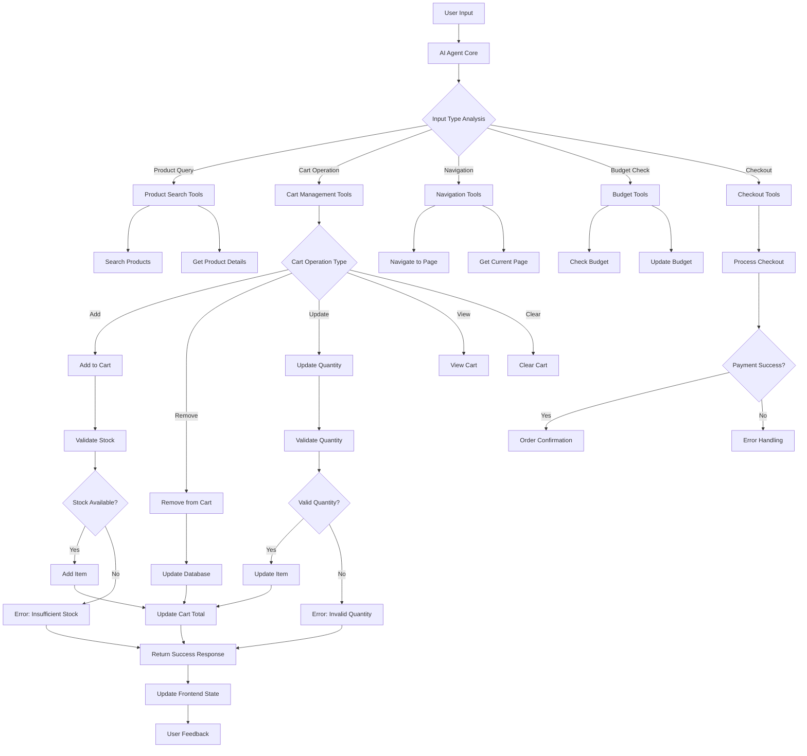
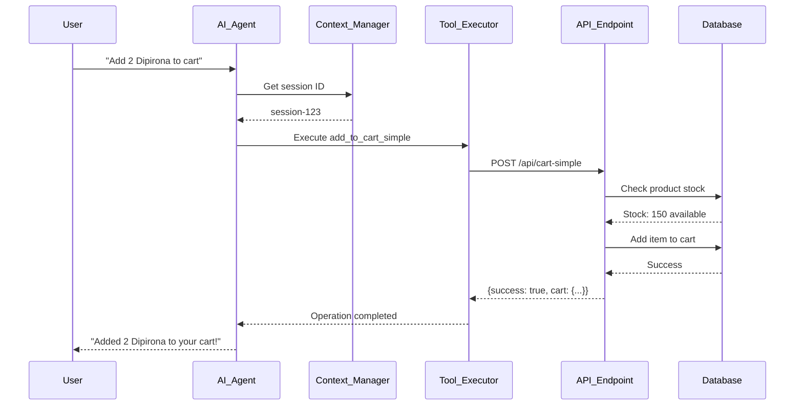
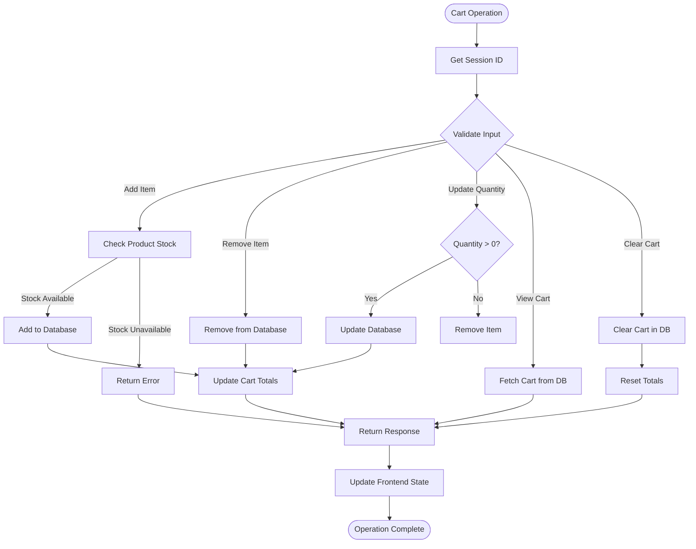

# AI Agent Workflow - Complete Mermaid Flowchart

## 🎯 Agent Architecture Overview



## 🔧 Agent Tool Flow - Detailed



## 🛒 Cart Management Flow



## 🔄 Session Management Flow

```mermaid
flowchart TD
    A[User Session Start] --> B{Session Exists?}
    B -->|Yes| C[Use Existing Session]
    B -->|No| D[Generate New Session]
    
    C --> E[Load Cart Data]
    D --> E
    
    E --> F[Initialize Cart State]
    F --> G[Ready for