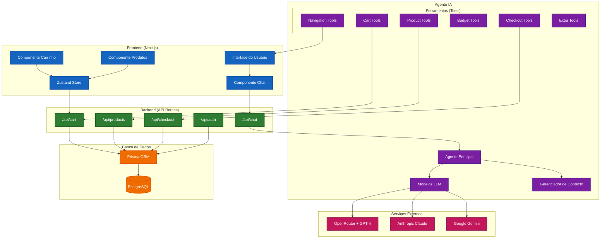
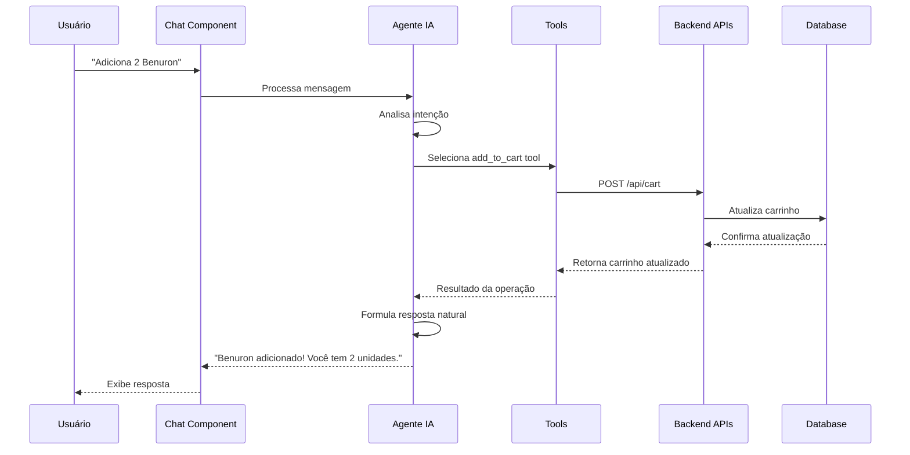
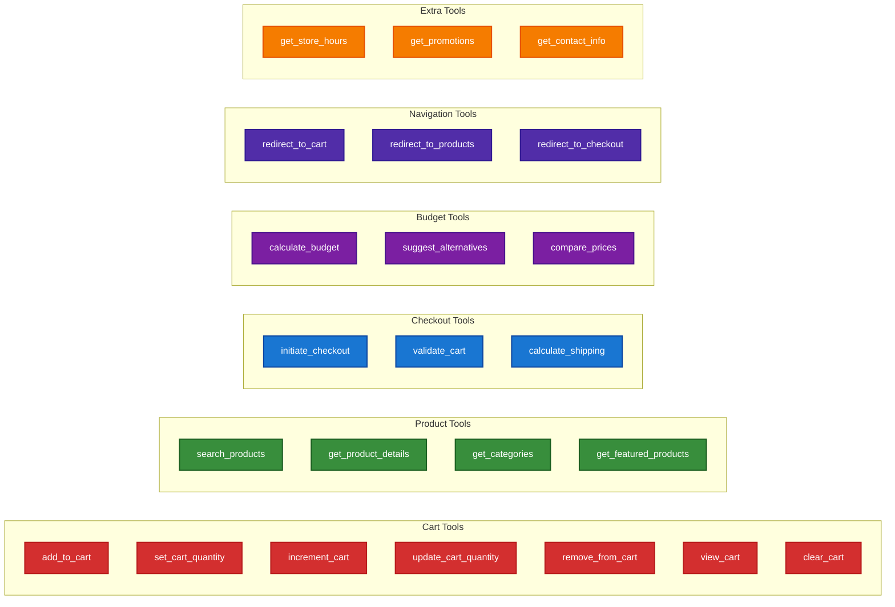
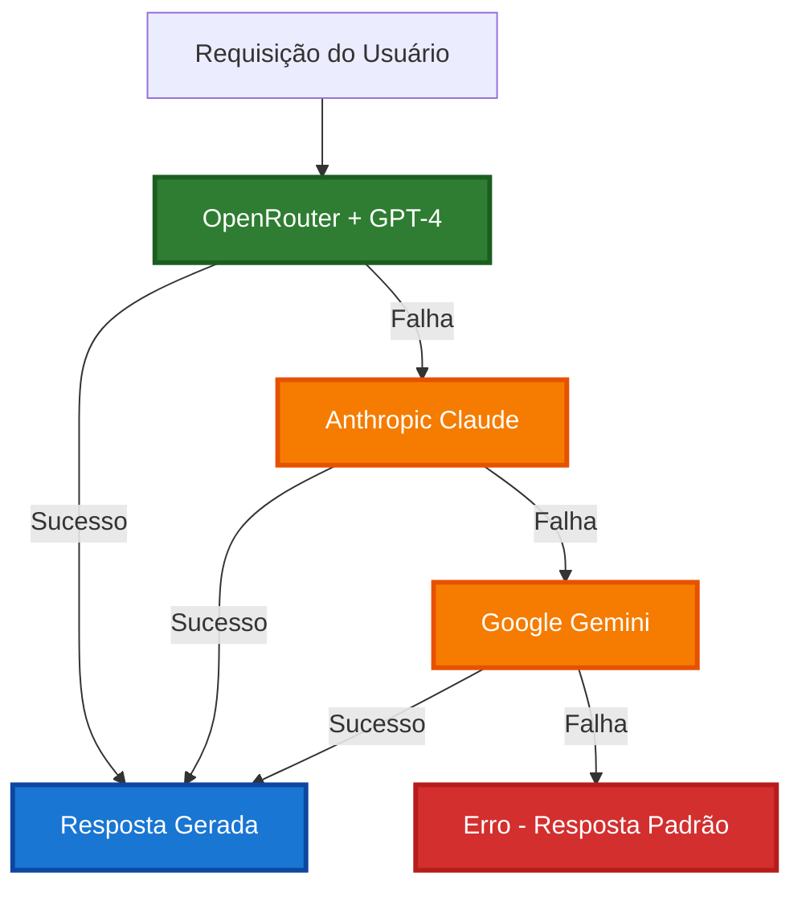
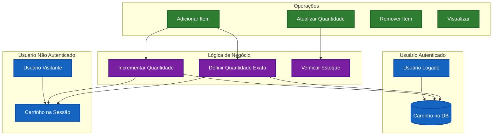

# 🏗️ Diagrama de Arquitetura - Sistema de Agente IA

## 📊 Arquitetura Geral do Sistema

## 🔄 Fluxo de Interação do Usuário

## 🛠️ Estrutura das Ferramentas (Tools)

## 🔄 Sistema de Fallback LLM

## 📊 Fluxo de Dados do Carrinho

---

## 📝 Como Usar os Diagramas

1. **Copie o código Mermaid** de qualquer seção
2. **Cole em ferramentas como**:
   - GitHub (suporte nativo)
   - Mermaid Live Editor
   - VS Code (extensão Mermaid)
   - Notion, Confluence, etc.

3. **Para apresentações**, exporte como PNG/SVG do Mermaid Live Editor