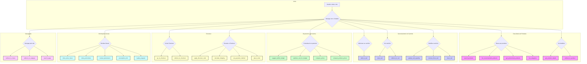

```mermaid
graph TD
    subgraph "Início"
        A[Usuário visita o site] --> B{Interage com o Chatbot}
    end

    subgraph "Descoberta de Produtos"
        B --> C{Busca por produtos}
        C --> C1[search_products]
        C --> C2[list_recommended_products]
        C --> C3[get_promotional_products]
        C --> C4[list_categories]

        B --> D{Ver detalhes}
        D --> D1[get_product_details]
        D --> D2[redirect_to_product]
    end

    subgraph "Gerenciamento do Carrinho"
        B --> E{Adicionar ao carrinho}
        E --> E1[add_to_cart]

        B --> F{Ver carrinho}
        F --> F1[view_cart]
        F --> F2[redirect_to_cart]

        B --> G{Modificar carrinho}
        G --> G1[update_cart_quantity]
        G --> G2[remove_from_cart]
        G --> G3[clear_cart]
    end

    subgraph "Orçamento e Economia"
        B --> H{Consultas de orçamento}
        H --> H1[suggest_within_budget]
        H --> H2[optimize_cart_for_budget]
        H --> H3[compare_prices]
        H --> H4[compare_product_prices]
    end

    subgraph "Checkout"
        B --> I{Iniciar Checkout}
        I --> I1[go_to_checkout]
        I --> I2[redirect_to_checkout]

        B --> J{Durante o Checkout}
        J --> J1[apply_discount_code]
        J --> J2[calculate_shipping]
        J --> J3[set_payment_method]
        J --> J4[place_order]
    end

    subgraph "Informações Gerais"
        B --> K{Dúvidas Gerais}
        K --> K1[show_store_hours]
        K --> K2[show_promotions]
        K --> K3[contact_pharmacist]
        K --> K4[prescription_info]
        K --> K5[loyalty_program]
    end

    subgraph "Navegação"
        B --> L{Navegar pelo site}
        L --> L1[redirect_to_home]
        L --> L2[redirect_to_category]
        L --> L3[search_page]
    end

    style C1 fill:#f9f,stroke:#333,stroke-width:2px
    style C2 fill:#f9f,stroke:#333,stroke-width:2px
    style C3 fill:#f9f,stroke:#333,stroke-width:2px
    style C4 fill:#f9f,stroke:#333,stroke-width:2px
    style D1 fill:#f9f,stroke:#333,stroke-width:2px
    style D2 fill:#f9f,stroke:#333,stroke-width:2px
    style E1 fill:#ccf,stroke:#333,stroke-width:2px
    style F1 fill:#ccf,stroke:#333,stroke-width:2px
    style F2 fill:#ccf,stroke:#333,stroke-width:2px
    style G1 fill:#ccf,stroke:#333,stroke-width:2px
    style G2 fill:#ccf,stroke:#333,stroke-width:2px
    style G3 fill:#ccf,stroke:#333,stroke-width:2px
    style H1 fill:#cfc,stroke:#333,stroke-width:2px
    style H2 fill:#cfc,stroke:#333,stroke-width:2px
    style H3 fill:#cfc,stroke:#333,stroke-width:2px
    style H4 fill:#cfc,stroke:#333,stroke-width:2px
    style I1 fill:#ffc,stroke:#333,stroke-width:2px
    style I2 fill:#ffc,stroke:#333,stroke-width:2px
    style J1 fill:#ffc,stroke:#333,stroke-width:2px
    style J2 fill:#ffc,stroke:#333,stroke-width:2px
    style J3 fill:#ffc,stroke:#333,stroke-width:2px
    style J4 fill:#ffc,stroke:#333,stroke-width:2px
    style K1 fill:#cff,stroke:#333,stroke-width:2px
    style K2 fill:#cff,stroke:#333,stroke-width:2px
    style K3 fill:#cff,stroke:#333,stroke-width:2px
    style K4 fill:#cff,stroke:#333,stroke-width:2px
    style K5 fill:#cff,stroke:#333,stroke-width:2px
    style L1 fill:#fcf,stroke:#333,stroke-width:2px
    style L2 fill:#fcf,stroke:#333,stroke-width:2px
    style L3 fill:#fcf,stroke:#333,stroke-width:2px
```
